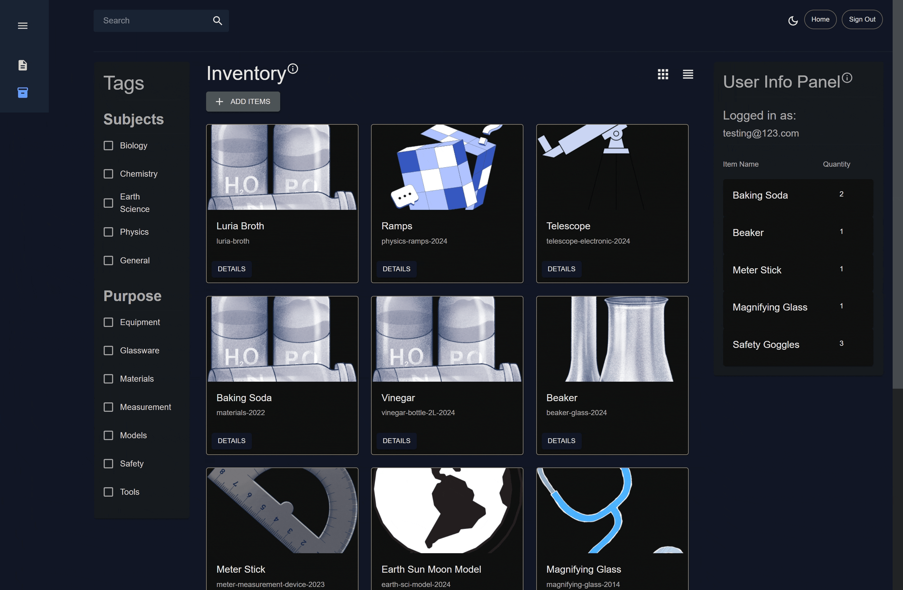
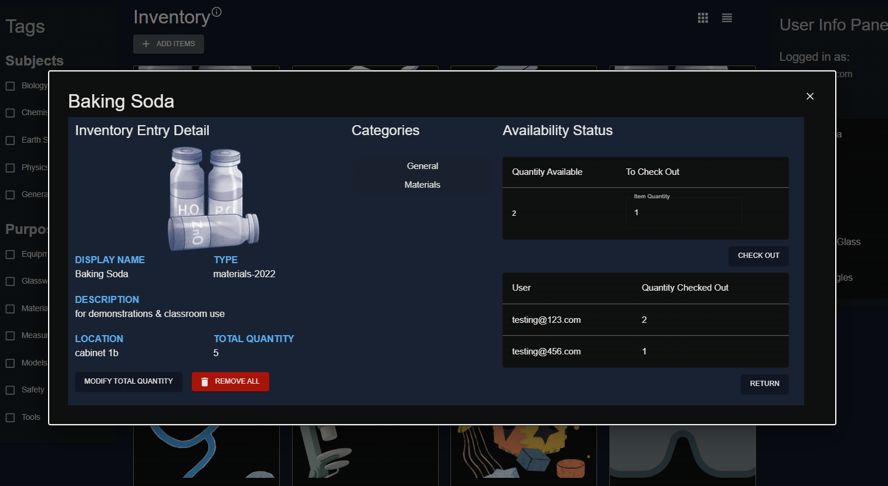
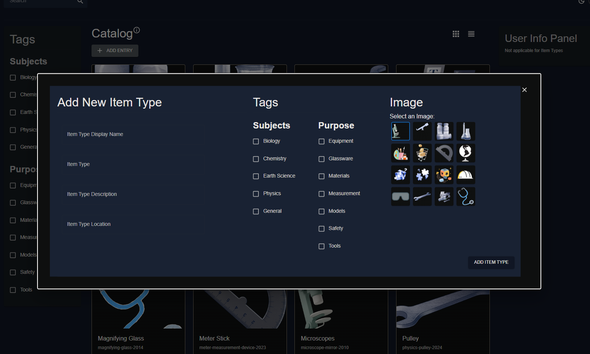
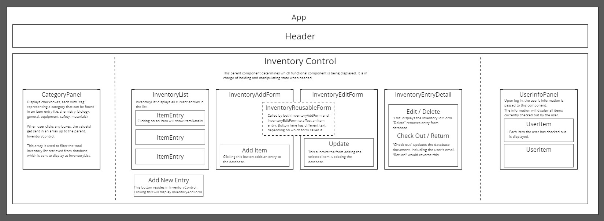

# Lab (Inventory) Manager

#### By Jon Cheng

#### This app is an inventory management system for tracking shared equipment and materials in the science laboratory. Users can search for items, log that they have taken it, and log that they have returned it. Tags can be added as categories to aid in finding items.

## Technologies Used

- _HTML_
- _CSS_
- _JavaScript_
- _TypeScript_
- _React.js_
- _Vite_
- _Firebase / Firestore_
- _Materials UI_
- _Bootstrap_
- _Node.js v18.17.1_
- _NPM v9.6.7_

## Description

_This app is my final project for my time at Epicodus. The front end is written with React.js and keeps track of information with a Firebase/Firestore cloud database. This app was created to help my former workplace (a small international school) and co-workers keep track of shared equipment and materials in the science laboratory. Users must create an account and then log in to use the app. The inventory list can be populated by adding entries. Each entry can be updated or deleted. The inventory list can be filtered by checking the boxes for tags, or by entering a search string at the search input field. When users decide to take an item from the lab in the real world, users should note this by clicking "check out" for the item in the app. Upon returning the item to the lab, the user should click "return". The app will keep track of all users and the items they have in their possession._

### Technology Choices / Rationale

_I chose to write the front end using React.js to improve my fluency with React. I used TypeScript, Vite, and Materials UI to push myself to learn new tools. For the database, I used NoSQL Firestore for two main reasons. NoSQL does not require a schema. From my current understanding, as I add complexity to the database, it will be easier to make updates without rebuilding the database from scratch -- as could be the case with SQL. The other reason, for practical purposes, is that if my former workplace were to use this application, Firestore will be reliably accessible around the clock without cost._

## Diagrams, Screenshots, Demos

_Demo: Search & Filters_



_Screenshot: Item Availability_



_Screenshot: Add New Items Form_



_The diagram below depicts the components for the application._



## Getting Started

### To get the front end running locally:

_1. Open your terminal (e.g., Terminal or GitBash)._

_2. Navigate to where you want to place the cloned directory._

_3. Clone the repository from the GitHub link by entering in this command:_

> ```bash
> $ git clone https://github.com/joncheng-dev/lab-inventory-tracker
> ```

- _In the command line, while in the project's root directory `lab-inventory-tracker`, run this command to install all packages and dependenies:_

> ```bash
> $ npm install
> ```

- _In the command line, while in the project's root directory `lab-inventory-tracker`, run this command to compile and execute the web application. This will host the application locally. Access it at http://localhost:5173/._

> ```bash
> $ npm run dev
> ```

- _To compile this web app and bundle the React code into the dist directory, enter:_

> ```bash
> $ npm run build
> ```

### To connect to Firestore database:

- _1. I have a Firestore database running for the application to make requests to. Contact me for the Firebase config information._
- _2. Create a `.env` file at the project's root directory. The config information will have to be entered here._

## Functionality Overview

### General functionality:

- _Authenticate users via Firebase authentication using email / password._
- _When logged in, all users have CRUD ability for items, which is saved in the database._
- _Users can read item details, and from there, "check out" or "return" an item._
- _To search for items, the list of inventory items can be filtered by search bar query, which looks for partial to complete name matches, or by category -- when checkbox clicked on the left CategoryPanel component._

## Known Bugs

- _It is currently possible to have empty input fields when submitting a form -- both new entry or edit entry._
- _If you happen upon any, please report your find with a descriptive message to joncheng.dev@gmail.com_

## License

```
MIT License

Permission is hereby granted, free of charge, to any person obtaining a copy
of this software and associated documentation files (the "Software"), to deal
in the Software without restriction, including without limitation the rights
to use, copy, modify, merge, publish, distribute, sublicense, and/or sell
copies of the Software, and to permit persons to whom the Software is
furnished to do so, subject to the following conditions:

The above copyright notice and this permission notice shall be included in all
copies or substantial portions of the Software.

THE SOFTWARE IS PROVIDED "AS IS", WITHOUT WARRANTY OF ANY KIND, EXPRESS OR
IMPLIED, INCLUDING BUT NOT LIMITED TO THE WARRANTIES OF MERCHANTABILITY,
FITNESS FOR A PARTICULAR PURPOSE AND NONINFRINGEMENT. IN NO EVENT SHALL THE
AUTHORS OR COPYRIGHT HOLDERS BE LIABLE FOR ANY CLAIM, DAMAGES OR OTHER
LIABILITY, WHETHER IN AN ACTION OF CONTRACT, TORT OR OTHERWISE, ARISING FROM,
OUT OF OR IN CONNECTION WITH THE SOFTWARE OR THE USE OR OTHER DEALINGS IN THE
SOFTWARE.

Copyright (c) 2024 Jonathan Cheng
```

<a align=left href="#">Return to Top</a>
